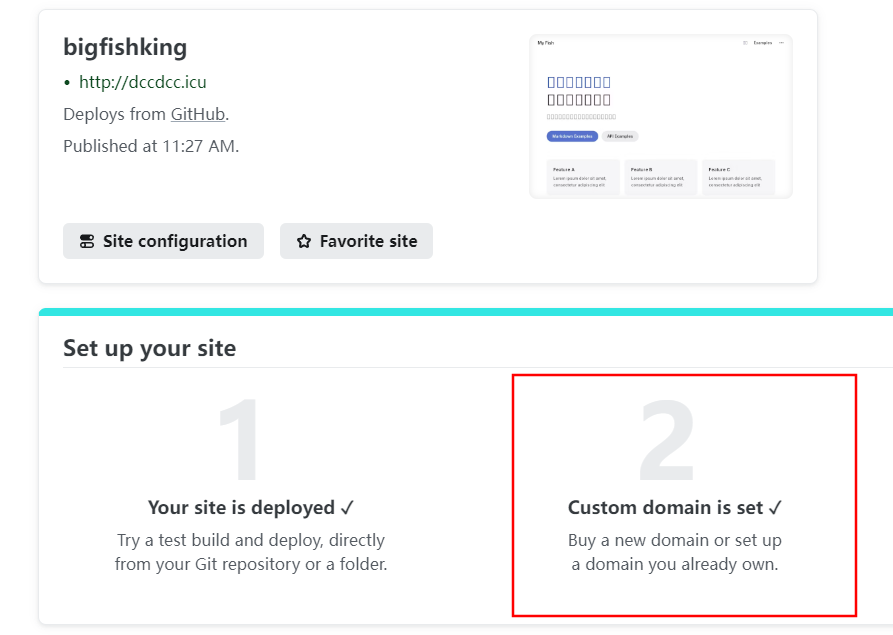
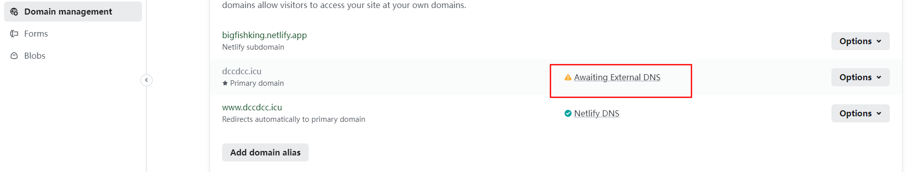
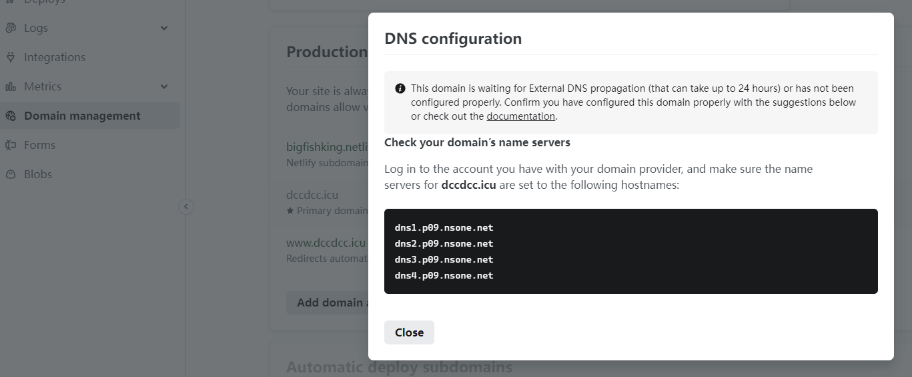
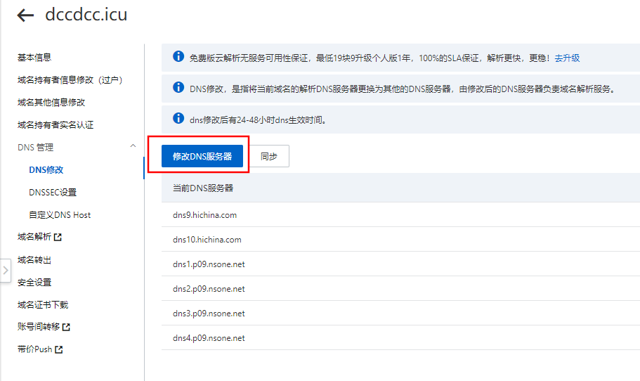
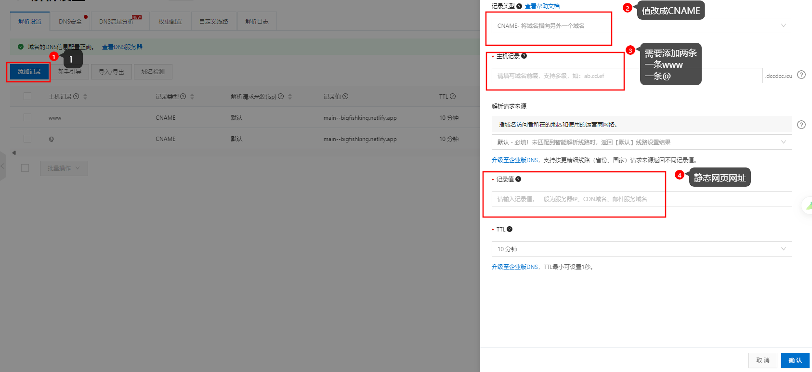
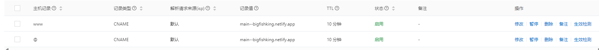

# 静态部署网址和阿里云域名DNS解析

## 静态部署网址
以netlify为例,部署好静态网址后。https://app.netlify.com/
```
1. 在netlify的setting中找到自定义域名
```
 
```
2. 添加域名，一直下一步，直到完成。
```
 
```
3. 出现DNS解析。
```   
 
```
4.  配置DNS，使用netlify的默认DNS。成功后会给你4个DNS。
```   
 
```
5. 接下来配置阿里云域名解析DNS
```
## 阿里云域名DNS解析

```
 配置DNS解析，添加netlify得到的4个DNS。注意：一定要添加阿里云默认的云解析DNS。
```
 
```
 配置阿里云解析
```
 
```
 配置完成的两条
```
 